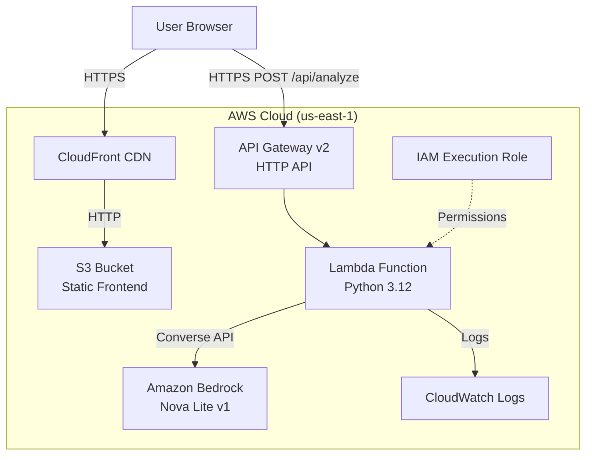
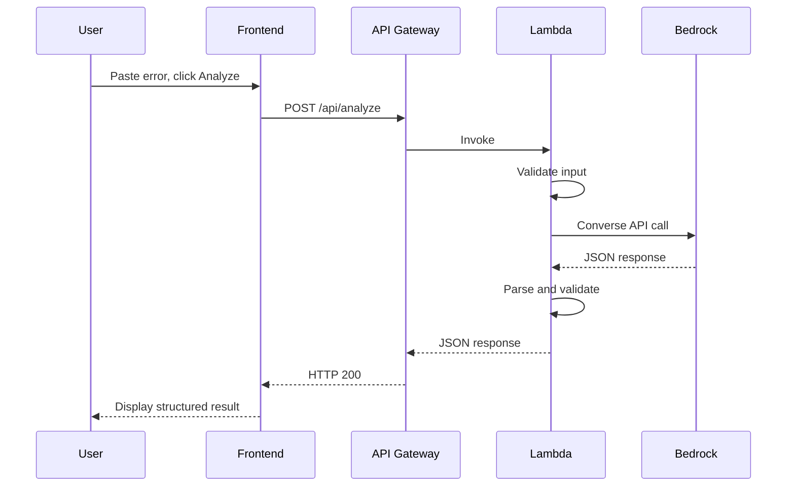
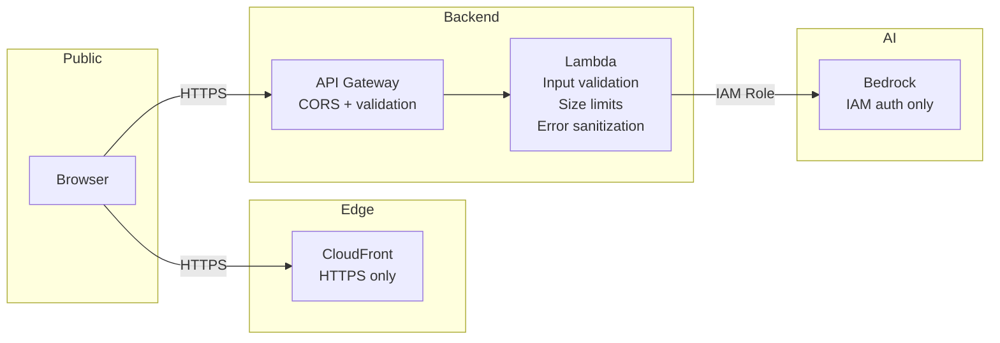

# DevFix Architecture

## Overview

DevFix is a stateless web application that analyzes error messages and code snippets using Amazon Bedrock's Nova Lite model. The architecture is fully serverless, minimizing operational overhead and cost.

## Architecture Diagram

## Components

### Frontend (S3 + CloudFront)

- **Technology**: React 19, TypeScript, Vite
- **Hosting**: S3 static website with CloudFront CDN
- **Responsibilities**:
  - Render the single-page application
  - Collect user input (error messages, code snippets)
  - Display structured analysis results
  - Handle loading, error, and empty states
  - Provide example errors for quick testing

### API Gateway

- **Type**: HTTP API (API Gateway v2)
- **Endpoint**: `POST /api/analyze`
- **CORS**: Configured to allow all origins
- **Purpose**: Route HTTP requests to the Lambda function

### Lambda Function

- **Runtime**: Python 3.12
- **Memory**: 256 MB
- **Timeout**: 30 seconds
- **Handler**: `handler.lambda_handler`
- **Responsibilities**:
  - Validate incoming requests (size, format, content)
  - Construct the system prompt and user message
  - Call Amazon Bedrock Converse API
  - Parse and validate the model's JSON response
  - Return structured results or safe error messages
  - Implement fallback parsing for malformed model output

### Amazon Bedrock

- **Model**: Amazon Nova Lite v1 (`amazon.nova-lite-v1:0`)
- **API**: Converse API
- **Parameters**:
  - maxTokens: 2048
  - temperature: 0.2
- **Output**: Structured JSON with analysis sections

## Request Flow

## IAM Permissions

The Lambda execution role follows least-privilege:

| Permission | Resource | Purpose |
|------------|----------|---------|
| `bedrock:InvokeModel` | `arn:aws:bedrock:*::foundation-model/amazon.nova*` | Call Bedrock models |
| `logs:CreateLogGroup` | Auto-managed | CloudWatch logging |
| `logs:CreateLogStream` | Auto-managed | CloudWatch logging |
| `logs:PutLogEvents` | Auto-managed | CloudWatch logging |

No `AdministratorAccess` or broad policies are used.

## Security Architecture

Key security properties:
- No credentials in the frontend
- No direct browser-to-Bedrock communication
- Input size limits (10,000 characters)
- Sanitized error messages (no ARNs, stack traces, or IAM details)
- Stateless design (no user data stored)
- HTTPS enforced via CloudFront

## Data Flow

1. User pastes error text in the browser
2. Frontend sends POST request to API Gateway
3. Lambda validates input (type, size, format)
4. Lambda constructs a Bedrock Converse API call with:
   - System prompt (debugging engineer persona)
   - User message (error text, optional language hint)
5. Bedrock returns analysis as structured JSON
6. Lambda validates the response format
7. If JSON parsing fails, Lambda creates a fallback response
8. Clean JSON returned to the browser
9. Frontend renders structured sections

No user data is persisted at any point in this flow.
